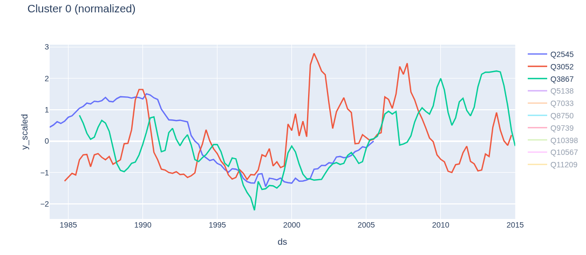
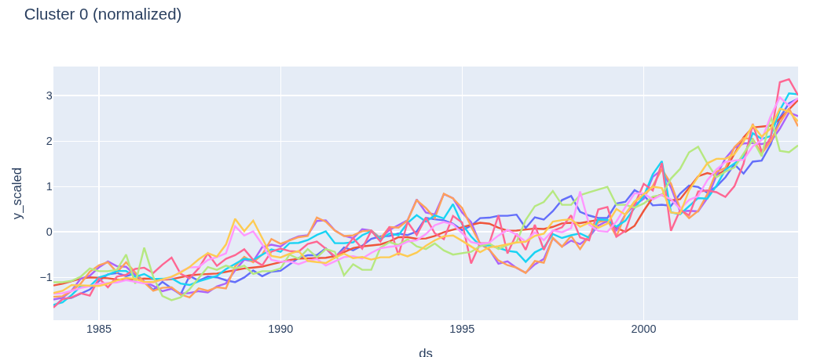

# Проект 1: локальные модели vs глобальные
**Гипотеза:** локальные модели на каждый ряд проигрывают глобальным моделям, если
рядов много и они похожи по структуре.

**Верхнеуровневый подход к проверке**: берём 200 рядов из `M4-dataset` и кластеризуем их алгоритмом `TSeriesKMeans`. После чего набор локальных моделей на все ряды и набор глобальных моделей, по одной на каждый кластер. Для обеих моделей мы будем использовать одни и те же признаки и одни и те же гиперпараметры моделей, чтобы нивелировать влияние внешних факторов. Для сравнения также добавим бейзлайны `Naive`, `SeasonalNaive`, `AutoETS` и `AutoARIMA`, а также глобальную модель, обученную на всех рядах сразу.

**Что ожидаем увидеть**: предположение в том, что либо локальные модели > кластерные модели > глобальная модель, либо кластерные модели > локальные модели > глобальная модель, где знак `A > B` означает, что модель `A` лучше модели `B`. Т.к. мы не занимаемся файн-тьюнингом ML-моделей, то мы вряд ли сможем победить `AutoETS` и `AutoARIMA`, но это не является целью данного проекта.

## Методология экспериментов

### 1. Датасет
В качестве датасета мы взяли 200 случайных рядов из M4-Quarterly dataset, взятые с официального гитхаба ([link](https://github.com/Mcompetitions/M4-methods)). Квартальный же датасет мы выбрали для простоты проведения эксперимента: это что-то среднее в плане периода, и достаточно маленький чтобы без проблем загрузить в оперативную память (Monthly dataset почему-то крашил jupyter kernel).

Для работы с датасетом пришлось проделать дополнительную работу по приведению датасета в длинный формат, т.к. изначально формат был 1 строка = 1 ряд + мета-информация в отдельной таблице. Также было принято решение ограничится выровненными рядами, чтобы кластеризация получилась разумной (подробнее ниже).

### 2. Кластеризация
В качестве алгоритма кластеризации был выбран `TimeSeriesKMeans` в первую очередь из-за простоты интерпретации и наличия библиотечной имплементации. По сути для кластеризации пришлось только привести `pd.DataFrame` к `np.ndarray`, а остальное за нас сделала библиотека.

При первой попытке кластаризовать ряды мы столкнулись с тем, что ряды с разными масштабами и с разными точками начала и конца расценивались алгоритмом как похожие, хотя таковыми не являлись. Пример:

(в ходе работы были примеры и худшей кластеризации). В целом понятно почему это произошло: метрика `DTW` не учитывает даты начала и конца, она сравнивает только форму графиков. А евклидово расстояние внутри `DTW` подвержено влияния масштаба.После нормализации рядов и рассмотрения только выровненных рядов, мы получили намного лучшую картину:

Можно увидеть, что некоторые ряды имеют практически одинаковую форму, и в целом видны общие характеристики по типу общего тренда.

Для выбора количества кластеров использовался метод локтя: строим график зависимости суммарного `DTW` при заданном количестве кластеров `k`, и находим последний момент резкого снижения. По такому принципу мы выбрали `k = 6`.

### 3. ML-модели
Для работы ML-моделей необходимо добавить дополнительные признаки. Мы приняли решение ограничится небольшим набором признаков, чтобы упростить эксперименты и избежать долгого обучения. Мы исходили из того, что если мы хотели сравнить работу одной и той же модели на разных наборах рядов, и поэтому не должно быть разницы, хорошо ли подобраны признаки или нет. В принципе можно было бы рассмотреть дизайн эксперимента, где мы сознательно оптимизировали бы признаки для каждого из вида моделей (локальной, кластерной, глобальной), но это заняло бы сильно больше времени и сил. Наш же дизайн как нам кажется тоже имеет право на существование и в какой-то мере может быть рассмотрен как часть ablation study.

В качестве же моделей мы использовали простой `CatBoost` c параметрами по-умолчанию. Не думаю, что здесь есть что объяснять: это просто универсальная модель с отличным качеством. Обучение проходило просто: `M4`-датасет сам предлагает разделение на обучающую и тестовые выборки, и мы придерживались данного разделения.

### 4. Метрики
На вряд ли выбор метрик имеет значительную роль в нашем эксперименте. По сути нам подходит любая метрика, т.к. нам нужно сравнить результаты разных моделей на одних и тех же данных. Так что в качестве метрик мы выбрали самое простое, что можно было применить: ... Опять же, можно было выбрать и другие метрики, но по сути это ни на что не повлияло бы.

## Анализ полученных результатов.
Приводим таблицу с метриками, полученными для каждой из моделей:

...
