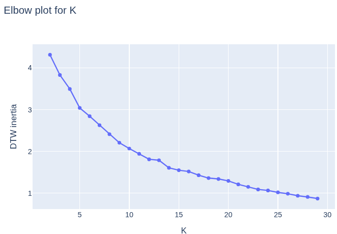
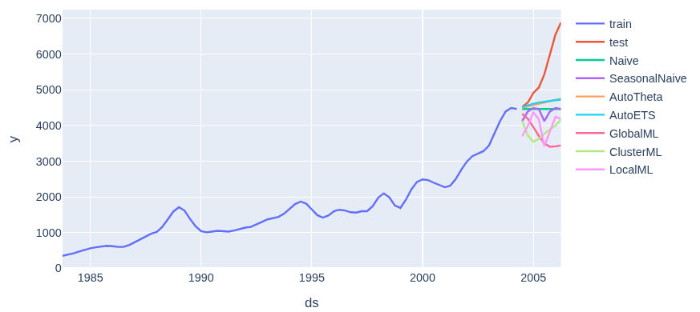

# Проект 1: локальные модели vs глобальные

## 1. Введение
**Гипотеза:** локальные модели на каждый ряд проигрывают глобальным моделям, если
рядов много и они похожи по структуре.

**Верхнеуровневый подход к проверке**: берём 200 рядов из `M4-dataset` и кластеризуем их алгоритмом `TSeriesKMeans`. Сравниваем 2 подхода:
1. Обучить набор локальных моделей, по одной на каждый ряд
2. Обучить набор глобальных моделей, по одной на каждый кластер рядов.

Для всех моделей мы будем использовать одни и те же признаки и одни и те же гиперпараметры моделей, чтобы нивелировать влияние внешних факторов. Для сравнения также добавим бейзлайны:
* Наивные: `Naive`, `SeasonalNaive`
* Эконометрические модели: `AutoETS` и `AutoTheta`
* Глобальная модель над всеми рядами (использует те же параметры, что и другие ML-модели)

**Что ожидаем увидеть**: предположение в том, что либо локальные модели > кластерных моделей > глобальной модели, либо кластерные модели > локальных моделей > глобальная модели, где знак `A > B` означает "модель `A` лучше модели `B`". Т.к. мы не занимаемся файн-тьюнингом ML-моделей и отсутствия подробной работы с рядами, мы не ожидаем высокого качества ML-моделей, так что мы вряд ли побьем `AutoETS` и `AutoTheta`. Однако даже в таком случае эксперимент будет осмысленным, т.к. модели обучаются в одинаковых условиях, а значит мы можем сравнить влияние подходов к предсказанию.

## 1.5. Распределение работы между участниками проекта.
Проект выполнили студенты Проскурин Александр и Гришин Лаврентий. Вообще не так просто разделить, кто что конкретно делал, но если выделять общими мазками, то работа была распределена следующим образом:
* Проскурин Александр:
    1. Работа с моделями: построение бэйзлайнов, создание признаков и обучение ML-моделей. Построение графиков предсказаний.
    2. Разбиение оригинального большого ноутбука на смысловые куски (в ходе проекта было удобнее работать в 1 ноутбуке, после чего надо было вынести тяжелые функции наружу). Оформление данного репозитория: написание `README.md`, `requirements.txt`, etc. Ну общее причесывание кода, чтобы она стал человеко-читаемым.
    3. Написание данного отчета. Анализ результатов экспериментов.
    4. Общая работа над проектом: дебаг, полировка кода, обсуждение результатов, etc.

* Гришин Лаврентий:
    1. Работа с датасетом `M4`: нашёл ссылку на `.csv` а не файлы с кастомным форматом `.tsf`, разобрался в формате данных, привёл данные к длинному формату. Научился сэмплить выровненные ряды.
    2. Работа с кластеризацией рядов: разобрался в алгоритме `TimeSeriesKMeans` (его кажется не было на лекциях, ну или мы не нашли), построил график для метода локтя, построил итоговую кластеризацию.
    3. Общая работа над проектом: дебаг, полировка кода, обсуждение результатов, etc.

## 2. Методология экспериментов

### 2.1. Датасет
В качестве датасета мы взяли 200 случайных рядов из `M4-Quarterly dataset`, взятые с официального гитхаба ([link](https://github.com/Mcompetitions/M4-methods)). Конкретно квартальный датасет мы выбрали для простоты проведения эксперимента: это что-то среднее в плане периода, и достаточно маленький чтобы не было проблем при загрузке датасета в `pandas` (`Monthly dataset` почему-то крашил `jupyter kernel`).

Для работы с датасетом пришлось проделать дополнительную работу по приведению датасета в длинный формат, т.к. изначально формат был "1 строка = 1 ряд" с дополнительной мета-информацией в отдельной таблице. В ходе работ было принято решение ограничится выровненными рядами, чтобы кластеризация получилась разумной (подробнее ниже). Для этого мы сгруппировали ряды в выровненные группы, оставили группы с достаточным количеством рядов, и после этого просэмплили 200 рядов из одной случайной группы.

### 2.2. Кластеризация
В качестве алгоритма кластеризации был выбран `TimeSeriesKMeans` в первую очередь из-за простоты интерпретации и наличия библиотечной имплементации. По сути для кластеризации пришлось только привести `pd.DataFrame` к `np.ndarray`, а остальное за нас сделала библиотека.

При первой попытке кластеризовать ряды мы столкнулись с тем, что ряды с разными масштабами и с разными точками начала и конца расценивались алгоритмом как похожие, хотя таковыми не являлись. Пример:

(в ходе работы были примеры и худшей кластеризации). В целом понятно почему это произошло: метрика `DTW` не учитывает даты начала и конца, она сравнивает только форму графиков. А евклидово расстояние внутри `DTW` подвержено влияния масштаба. При этом для ML-моделей важны оба параметра. Поэтому мы решили сразу нормализовать ряды и сэмплить только выровненные ряды. После этого мы получили намного лучшую картину:

Можно увидеть, что некоторые ряды имеют практически одинаковую форму, и в целом видны общие характеристики по типу общего тренда.

Для выбора количества кластеров использовался метод локтя: строим график зависимости суммарного `DTW` при заданном количестве кластеров `k`, и находим последний момент резкого снижения. По такому принципу мы выбрали `k = 5`.

### 3. ML-модели
Для работы ML-моделей необходимо добавить дополнительные признаки. Мы приняли решение ограничится небольшим набором признаков, чтобы упростить эксперименты и избежать долгого обучения (детали можно посмотреть в `src/ml_models.py:add_features`) Мы исходили из того, что мы хотели сравнить работу одной и той же модели на разных наборах рядов, и поэтому не должно быть разницы, хорошо ли подобраны признаки или нет. В принципе можно было бы рассмотреть дизайн эксперимента, где мы сознательно оптимизировали бы признаки для каждого из вида моделей (локальной, кластерной, глобальной), но это заняло бы сильно больше времени и сил. Наш же дизайн как нам кажется тоже имеет право на существование и в какой-то мере может быть рассмотрен как часть ablation study.

В качестве же моделей мы использовали простой `CatBoost` c параметрами по-умолчанию. Не думаю, что здесь есть что объяснять: это просто универсальная модель с отличным качеством. Обучение проходило просто: `M4`-датасет сам предлагает разделение на обучающую и тестовые выборки, и мы придерживались данного разделения.

### 4. Метрики
На вряд ли выбор метрик имеет значительную роль в нашем эксперименте. По сути нам подходит любая метрика, т.к. нам нужно сравнить результаты разных моделей на одних и тех же данных. Так что в качестве метрик мы выбрали самое простое, что можно было применить: `sMAPE`. Для неё даже ряды нормировать не обязательно. Опять же, можно было выбрать и другие метрики, но по сути это содержательно на эксперимент не повлияло бы.

## 3. Результаты эксперимента.
Приводим таблицу с метриками, полученными для каждой из моделей:

| model         | sMAPE   |
|---------------|--------|
| AutoETS       | 0.036463 |
| AutoTheta     | 0.036586 |
| Naive         | 0.050769 |
| SeasonalNaive | 0.061119 |
| **ClusterML** | **0.080177** |
| **LocalML**   | **0.088672** |
| **GlobalML**  | **0.097452** |

Мы видим, что `ClusterML` действительно показал себя лучше, чем `LocalML`. Из плохого, мы видим, что все `ML` модели показали достаточно плохие результаты, заметно хуже даже наивного прогноза. С другой стороны видно, что это глобальная проблема для `ML` моделей с выбранными признаками на выбранных рядах, что видно по глобальной модели. Возможно это связанно с отсутствием явной структуры в рядах, что в целом видно по некоторым примерам предсказаний, где ни одна модель не угадывает резкий тренд

Скорее всего было бы лучше выделить тренды и сезонность с помощью того же `STL` разложения, а потом уже пытаться делать предсказания на остатках. Но это уже много дополнительной работы, так что за неделю не успели.

К сожалению, у нас не было времени разобраться, почему у нас получились настолько плохие метрики `ML` моделей. С другой стороны, как мы уже неоднократно подчеркивали, мы обучали модели на одинаковых признаках и на одинаковой модели. Так что и такое сравнение тоже имеет место быть.

## 4. Выводы
Наши эксперименты подтвердили гипотезу о том, что локальные модели проигрывают глобальным моделям, обученным на кластерах похожих рядов.
